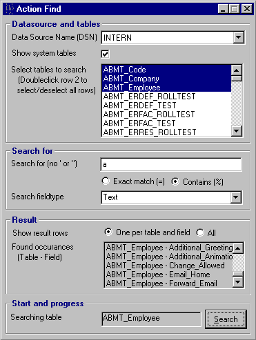

## ActionFind

### Description

Ever wanted to find a special value in a database, but don't know in which table or field it's in. This tool helps you scan for a value in a database with 1 ore more tables in it. Only works on SQL Server. This tool can match exact or "LIKE" querys and has some other features. If you like it, improve it! :) (and tell me about it)
 
### More Info
 

             |
---                |---
**Submitted On**   |2003-02-13 16:42:36
**By**             |[Martin Idman](https://github.com/Planet-Source-Code/PSCIndex/blob/master/ByAuthor/martin-idman.md)
**Level**          |Intermediate
**User Rating**    |5.0 (10 globes from 2 users)
**Compatibility**  |VB 6\.0
**Category**       |[Databases/ Data Access/ DAO/ ADO](https://github.com/Planet-Source-Code/PSCIndex/blob/master/ByCategory/databases-data-access-dao-ado__1-6.md)
**World**          |[Visual Basic](https://github.com/Planet-Source-Code/PSCIndex/blob/master/ByWorld/visual-basic.md)
**Archive File**   |[Action\_Fin1543532132003\.zip](https://github.com/Planet-Source-Code/martin-idman-actionfind__1-43170/archive/master.zip)

